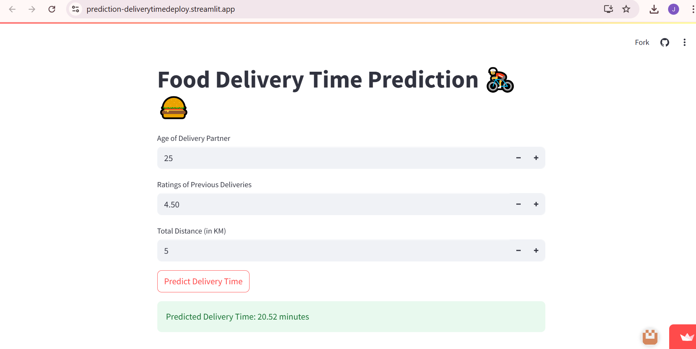

# Food Delivery Time prediction

---
## **Food Delivery Time Prediction App**

### **About**

This project is a **team-developed Streamlit web application** designed to predict the **delivery time** for food deliveries based on several key features such as the **age of the delivery partner**, the **ratings of their previous deliveries**, and the **distance** to be covered. The prediction is powered by a **Long Short-Term Memory (LSTM)** model, which has been trained to estimate delivery times based on historical data.

### **Team Collaboration**

This project was developed by a me, Dharshana.s, Harshini.A working collaboratively to design and deploy an efficient solution for food delivery services. The team was responsible for:

* **Data Collection & Preparation**: Gathering historical delivery data and preprocessing it for training the model.
* **Model Development**: Building and fine-tuning the **LSTM model** for accurate prediction of delivery times.
* **Web Application Development**: Creating an intuitive and user-friendly **Streamlit interface** for real-time predictions.
* **Testing & Deployment**: Ensuring the model's performance, user experience, and deployment on a working platform.

### **Key Features**

1. **User Inputs**:

   * The app provides **three input fields** to the user:

     * **Age of Delivery Partner**: Age of the person making the delivery (between 18 and 80 years).
     * **Ratings of Previous Deliveries**: Rating (from 0 to 5) based on the previous deliveries made by the partner.
     * **Distance**: The distance (in kilometers) from the restaurant to the destination.

2. **LSTM Model for Prediction**:

   * The core of the app is a **Long Short-Term Memory (LSTM)** model, a type of **Recurrent Neural Network (RNN)** suitable for sequential data.
   * The model has been trained on historical delivery data to predict how long a delivery will take based on the input parameters.

3. **Real-Time Prediction**:

   * Once the user inputs the required data and clicks on the **"Predict Delivery Time"** button, the model processes the input and predicts the **delivery time** (in minutes).
   * The app reshapes the input data appropriately for the LSTM model and returns a prediction in **real-time**.

4. **User Interface**:

   * The app provides a **clean, user-friendly interface** via **Streamlit**, where users can quickly input values and get predictions without any complexity.
   * The output is displayed immediately after the prediction, providing the estimated **delivery time** with two decimal precision.

5. **Interactive Features**:

   * The app is designed to offer an interactive and intuitive experience. The **"Predict Delivery Time"** button initiates the prediction process based on the given input values.

### **Technology Used**

* **Streamlit**: A Python framework for creating interactive web applications. It provides an easy way to build UI components like sliders, text boxes, and buttons.
* **Keras (with TensorFlow)**: A high-level deep learning API used for training and running the **LSTM model**.
* **NumPy**: Used to handle numerical data and reshape input arrays as required by the LSTM model.

### **How the LSTM Model Works**

* **Input Data**: The model takes in **three features**: age, ratings, and distance. These features are reshaped to match the input format expected by the LSTM.
* **Prediction Process**: Once the input data is provided, the LSTM model computes the predicted delivery time by analyzing the relationship between these features and the delivery time based on historical data.
* **Output**: The model outputs the **predicted delivery time** as a floating-point number representing the time in minutes.

### **Benefits**

1. **Improved Efficiency**: The app helps delivery services and companies better estimate delivery times, optimizing their operations and managing customer expectations.

2. **Real-Time Predictions**: By using an LSTM model, the app can predict delivery times in real time, making it valuable for **logistics and food delivery companies**.

3. **Personalization**: The inclusion of **delivery partner ratings** allows for more personalized predictions based on the experience and reliability of the delivery partner.

### **Conclusion**

The **Food Delivery Time Prediction App** is an efficient tool designed to predict delivery times based on key factors such as the delivery partner’s age, past performance, and distance. Using an advanced **LSTM model**, the app provides accurate and real-time predictions that can help food delivery services streamline their operations and improve customer satisfaction. Developed by a collaborative team, the app emphasizes both technical sophistication and user-centric design. The **team's combined effort** ensures that the solution is both scalable and practical for real-world applications.

---

